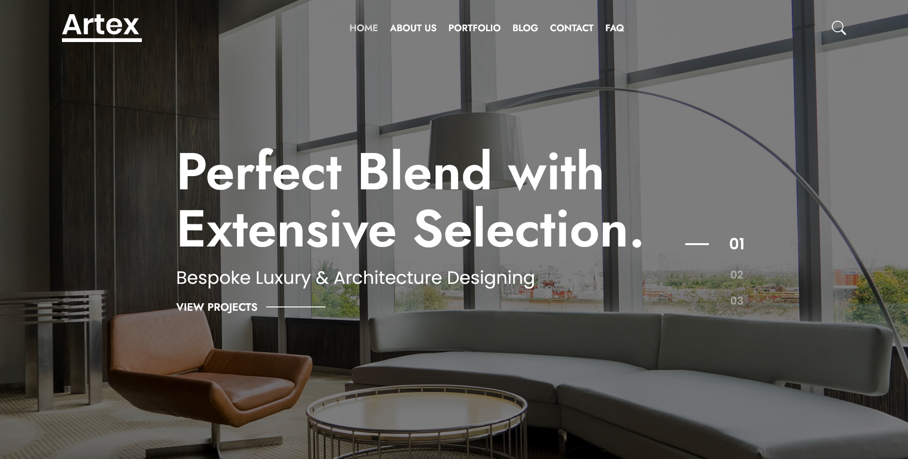

# Artex

A one-stop solution for bespoke architectural and interior design services. Artex seamlessly connects clients with a network of skilled architects and designers to bring their visions to life.

## Table of contents

- [Overview](#overview)
  - [Links](#links)
  - [Features](#features)
  - [Built with](#built-with)
  - [Screenshot](#screenshot)
- [Author](#author)
- [Acknowledgments](#acknowledgments)

## Overview

### Links

- Live Site URL: [Live Demo](https://kagiso31.github.io/artex)

### Features

- Responsive Design
- Google Maps API

### Built with

- Semantic HTML5 markup
- Mobile-first workflow
- [React](https://reactjs.org/)
- [TypeScript](https://www.typescriptlang.org/)
- [Sass](https://sass-lang.com/)

### Screenshot

## Author

- Website - [Kagiso Mokou](https://kagiso31.github.io/portfolio)
- LinkedIn - [Kagiso Mokou](https://www.linkedin.com/in/kagiso-mokou-50824a264)

## Acknowledgments

Design by - [RadiusTheme](https://www.radiustheme.com/)
